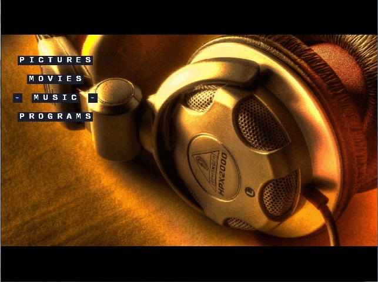
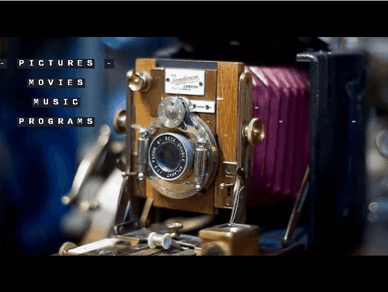

# Dreamcast-Media-Center-DCMC-V3.0
Update of  Josh PH3NOM Pearson 2010-2013 Mediaplayer

This software uses works derived from the independant JPEG group.

All libraries that are used under GPL license include original documentation.

All work created by me is free for public use and or modification.

First you need to build the libraries:

OpenGL (Beta Build)      
libopengl: GL/makefile

Dolby Digital Audio Codec:
liba52: liba52/liba52/makefile

FLAC Audio Codec:
libflac: libflac/src/libFLAC/makefile

MP4/AAC Audio Codec:
libfaad_2.27: libfaad/libfaad/makefile
libmp4ff: libfaad/common/mp4ff/makefile

MP3 Audio Codec:
libmpg123_1.13.1: libmpg123/libmpg123/makefile

Mpeg2 Video Codec:
libmpeg2: libmpeg2/libmpeg2/makefile

XviD Video Codec:
libxvidcore_1.3.0: libxvid/src/makefile

Then you can build DCMC main binary

#Update notes Ian Micheal  
Sh4 math optimzing using DreamHal Moop :)
Xvid now using fastmemset from DreamHAL and also ported sh4 asm idct_sh4.c 
Opengl Now using sh4math From DreamHAL
New theme PVR VQ using less memory
#libs are rared you have to unpack each before building Importain
#Unpack each one and build before building the DCMC 

DreamHAL https://dcemulation.org/phpBB/viewtopic.php?t=105371
https://dreamcast.wiki/File:DreamHAL-2020-05-13.zip
About Moopthehedgehog
One of the best coders i did know sorry to see you go the help and support with learning sh4asm and your wonderful creation DreamHAL 
Makes a big change to what i do on dreamcast.. :) your missed my freind :)
